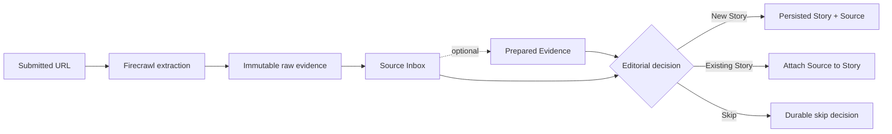

# StoryRail

[](https://github.com/BlackSwampAI/StoryRail/actions/workflows/ci.yml)

> An agent-first editorial control plane that turns incoming evidence into deliberate, reviewable publishing work.

StoryRail helps solo publishers and small editorial teams manage the work that begins before an article editor: preserving source evidence, deciding what deserves coverage, organizing Stories, and—eventually—coordinating bounded writing and review agents. It is a headless editorial system, not a page-building CMS.

**Status: pre-alpha and under active development. StoryRail is not production-ready.**

## What is StoryRail?

StoryRail separates evidence acquisition, editorial decisions, writing, review, and publication into explicit stages with durable state and human supervision.

Its central distinction is **Source ≠ Story**:

- A **Source** is incoming evidence, such as a submitted URL and its extraction history.
- A **Story** is an editorial decision to pursue and organize coverage.
- An **Article** is a versioned editorial work product. Article generation and persistence are planned, not implemented yet.

One Story may draw on many Sources. A Source may be skipped or attached to an existing Story; submitting a URL never creates a Story automatically.

## Why StoryRail?

Traditional CMS products begin with an article editor. StoryRail begins earlier:

```text
source evidence → editorial decision → Story → assignment → writing → review → publication
```

Small teams need to preserve provenance, make automation inspectable, and keep editorial and publishing decisions under operator control. The current pre-alpha exposes those primitives manually before automating them with agents.

## Current workflow



Prepared Evidence is model-derived, cleaned evidence. It never replaces the immutable raw extraction; both histories remain available for audit and survive triage and reload.

Durable configuration profiles now exist for the Assignment Editor, Writer, and Director/editor-in-chief roles, but those agents do not execute. Assignments, Article generation, revision, approval, and publishing automation remain planned.

## What works today

- URL Source preservation with conservative canonicalization and exact-duplicate detection.
- Firecrawl v2 Markdown extraction using its automatic proxy strategy.
- Rejection of obvious challenge/interstitial responses as failed extraction attempts.
- Immutable, append-ordered raw extraction history, including durable failures and retries.
- A PostgreSQL-backed Source Inbox with durable **New Story**, **Existing Story**, and **Skip** triage.
- Persistent Story queues, Story creation, Source-to-Story attachments, and Story inspection.
- Manual Prepared Evidence generation through a provider-neutral model boundary, LangChain, and OpenRouter.
- Immutable successful and failed preparation history alongside the original raw evidence.
- Reconstruction of raw and prepared evidence from PostgreSQL after triage or browser reload.
- Immutable, PostgreSQL-backed Agent Profiles with built-in Assignment Editor, General Writer, and Director configurations plus custom Writer creation and optional provider-neutral model selection.

## Where StoryRail is going

The planned alpha path continues from a Story through an Assignment Editor, a structured Assignment, a configurable Writer, a persisted Article, and independent Director/editor-in-chief review. The intended bounded revision loop ends in an operator-controlled approval or rejection, followed by a separate, explicit publish/export transition.

Those agents and Article workflows are not operational today. Agent Profiles configure future work but do not contact a model. Future work also includes Assignment-linked profile use, mutable profile/version management, resolved triage history as editorial memory, and improved self-hosting packaging.

## Core concepts

- **Source** — preserved incoming evidence. A URL Source retains the exact submitted URL and a conservative canonical URL.
- **Raw Extraction** — an immutable Firecrawl success or failure record. Retries append new records rather than overwrite history.
- **Prepared Evidence** — an immutable model-derived attempt to clean a successful raw extraction. It is optional and never authoritative over raw evidence.
- **Source Inbox** — the queue of preserved Sources awaiting a final editorial decision.
- **Triage Decision** — an attributable, durable choice to create a Story, attach to an existing Story, or skip coverage.
- **Story** — the central editorial object that groups evidence and will carry work through the editorial lifecycle.
- **Agent Profile** — an immutable configuration snapshot for a bounded editorial persona and optional provider-neutral model selection; profiles do not execute agents.
- **Assignment, Writer, Director, and Article** — planned concepts for later stages of the alpha workflow.

## Architecture

StoryRail is a Next.js 16 / React 19 application backed by PostgreSQL. Its domain and application layers define provider-neutral editorial rules and ports; external systems are attached through replaceable adapters. Firecrawl is the current extraction adapter, while LangChain and OpenRouter provide the current structured-model path for Prepared Evidence.

PostgreSQL is authoritative for editorial state. Source extractions, evidence preparations, attachments, and triage decisions preserve auditable facts rather than relying on agent memory or overwriting history.

See the [OpenWiki architecture overview](openwiki/architecture/overview.md) for deeper code-grounded documentation, or browse the [technical documentation index](openwiki/index.md).

## Getting started

### Prerequisites

- Node.js 24 (`package.json` requires `>=24.15.0 <25`; `.nvmrc` pins 24.18.0)
- pnpm 11.20.0 through Corepack
- PostgreSQL with an application database you control
- A Firecrawl API key for URL extraction
- An OpenRouter API key and model name only if you want to prepare evidence

### Install and run

```bash
corepack enable
pnpm install --frozen-lockfile
cp .env.example .env
pnpm dev
```

Before starting the app, configure `.env` and apply every SQL file in `database/migrations/` externally in numeric order. StoryRail does not currently include a migration runner and does not apply migrations automatically; use the PostgreSQL administration or migration tool appropriate to your environment.

Open [http://localhost:3000](http://localhost:3000) to use the development newsroom.

## Environment variables

| Variable                               | Required for                      | Purpose                                                                        |
| -------------------------------------- | --------------------------------- | ------------------------------------------------------------------------------ |
| `STORYRAIL_DATABASE_URL`               | All persisted workflows           | PostgreSQL connection string for editorial state.                              |
| `STORYRAIL_OPERATOR_ID`                | Operator-attributed HTTP actions  | Identifies the current fixed development operator; this is not authentication. |
| `FIRECRAWL_API_KEY`                    | URL intake/extraction             | Authenticates Firecrawl v2 requests.                                           |
| `OPENROUTER_API_KEY`                   | Prepared Evidence only            | Authenticates the current OpenRouter model adapter.                            |
| `STORYRAIL_EVIDENCE_PREPARATION_MODEL` | Prepared Evidence only            | Selects the OpenRouter model used for evidence preparation.                    |
| `STORYRAIL_TEST_DATABASE_URL`          | PostgreSQL integration tests only | Points to a disposable database named exactly `storyrail_test`.                |

Normal Story, Inbox, triage, inspection, and Agent Profile workflows do not require Firecrawl or OpenRouter. Raw URL intake requires Firecrawl but not OpenRouter.

## Development and validation

Available project scripts:

```bash
pnpm dev
pnpm format:check
pnpm lint
pnpm typecheck
pnpm test
pnpm test:postgres
pnpm build
```

`pnpm test:postgres` requires `STORYRAIL_TEST_DATABASE_URL`. See [OpenWiki's engineering workflow](openwiki/engineering-workflow.md) and [CONTRIBUTING.md](CONTRIBUTING.md) for the full maintainer-owned verification sequence.

## Project status and limitations

StoryRail is a development-oriented pre-alpha. It currently has no authentication, migrations are external/manual, and some anti-bot publishers remain inaccessible through Firecrawl. Assignment, writing, review, Article, and publishing workflows are not yet implemented, and the newsroom UI is still designed for development rather than production operations.

## Technical documentation

The generated [OpenWiki documentation](openwiki/index.md) provides deeper, code-grounded coverage of the architecture, domain model, workflows, persistence schema, HTTP API, newsroom UI, and engineering workflow. Human-authored product direction lives under [`docs/product/`](docs/product/), and architectural decisions are indexed under [`docs/architecture/`](docs/architecture/README.md).

## License

StoryRail is licensed under the [GNU Affero General Public License version 3](LICENSE).
