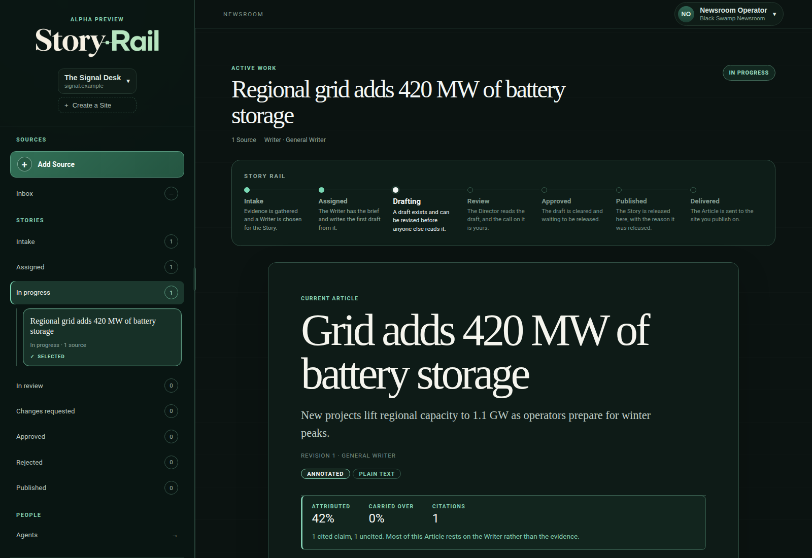

# StoryRail

[](https://github.com/BlackSwampAI/StoryRail/actions/workflows/ci.yml)
[](LICENSE)
[](https://nodejs.org/)
[](https://pnpm.io/)
[](#project-status)

StoryRail is an agent-first editorial control plane for solo publishers and small editorial teams. It turns source material into researched, reviewed stories, with editorial state and evidence preserved in PostgreSQL. It is a newsroom workflow, not a page-building CMS.

**StoryRail is pre-alpha software. It has no authentication and is not ready for public or production deployment.**

## Editorial objects

StoryRail keeps three objects distinct:

- **Source** is incoming material and its extraction history. Sources retain provenance and can be attached to coverage without losing their original records.
- **Story** is the central editorial object: a decision to pursue and organize coverage. A Story can group many Sources and track work through review and publication.
- **Article** is a versioned work product belonging to a Story. Its ordered blocks distinguish factual claims from context and headings. Claims carry citations to a Source, a specific evidence record, and the supporting passage.

An Article citation is checked against preserved evidence before it can be recorded. The newsroom can open a claim to inspect its supporting passage and follow the Source. PostgreSQL is authoritative for persisted editorial state; agent memory is not.

## Workflow

```text
Submit URL → preserve and extract evidence → triage into a Story
           → research and assign → draft cited Article → review
           → approve → publish → optionally deliver to a destination
```

Operators can work each step directly or authorize Autopilot to run the existing workflows in sequence. Policy runs and tool calls are durable records, with reconciliation workflows for work interrupted by a process failure. Agents have bounded tool access, and external tool results are treated as untrusted input.

StoryRail keeps **editorial publication** separate from **delivery**. Approval and publication record the Story's editorial state. A separate delivery workflow can send an Article from a published Story to a configured destination, including WordPress as Gutenberg blocks, while preserving delivery outcomes and reconciliation decisions. Destinations are replaceable adapters.

## Screenshots

These screenshots show the actual newsroom and claim reader with fictional demo data. See the [capture notes](docs/screenshots/README.md).




## Highlights

- Durable Source intake, immutable extraction attempts, evidence preparation, and triage into a new Story, an existing Story, or a skipped item.
- Research, operator-reviewed assignments, bounded agent profiles, and durable run records.
- Cited Article revisions with evidence-grounding checks and inspectable claim provenance.
- Operator-controlled review decisions, publication, and separate destination delivery.
- Durable Autopilot policy runs, recorded tool calls, and reconciliation for interrupted work.
- Per-Site settings and encrypted connector credentials, allowing multiple newsroom Sites to be configured independently.
- PostgreSQL migrations and persistence adapters that keep editorial state explicit and auditable.

## Get started

### Requirements

- Node.js `24.18.0` (the `.nvmrc` version; supported range is `>=24.15.0 <25`)
- pnpm `11.20.0` through Corepack
- PostgreSQL

Some workflows need provider credentials: Firecrawl for URL extraction, and credentials for the model or delivery provider being used. Local workflows such as browsing persisted newsroom state do not need all providers configured.

### Install and run

```bash
corepack enable
pnpm install --frozen-lockfile
cp .env.example .env
```

Set `STORYRAIL_DATABASE_URL`, `STORYRAIL_OPERATOR_ID`, and `STORYRAIL_CREDENTIAL_KEY` in `.env`. The operator ID identifies local editorial actions; the credential key is needed to save encrypted provider credentials in Settings. Apply migrations to your development database with Node's env-file option:

```bash
node --env-file=.env scripts/migrate.ts up
pnpm dev
```

Open [http://localhost:3133](http://localhost:3133). The `pnpm migrate` shortcut reads `STORYRAIL_DATABASE_URL` from the process environment, so export that variable before using the shortcut. Migrations are run explicitly; the app does not apply them at startup.

### Configuration

`.env.example` lists the supported server environment variables:

- `STORYRAIL_DATABASE_URL` — PostgreSQL connection for persisted editorial state.
- `STORYRAIL_CREDENTIAL_KEY` — Base64-encoded 32-byte key used to encrypt stored provider credentials. Generate with `openssl rand -base64 32`; keep it outside the database.
- `STORYRAIL_SITE_ID` — Selects the Site served by this process when multiple Sites exist.
- `STORYRAIL_OPERATOR_ID` — Fixed operator identity for development HTTP actions; this is not authentication.
- `STORYRAIL_OPENROUTER_BASE_URL` — Optional base URL override for an OpenRouter-compatible provider.

Provider credentials and model choices are configured per Site in the newsroom settings. Do not commit `.env` or real credentials. Because the app has no authentication, keep the development server private to your machine or a trusted network.

## Development

Useful commands from `package.json`:

```bash
pnpm dev
pnpm migrate:status
pnpm format:check
pnpm lint
pnpm typecheck
pnpm test
pnpm test:postgres
pnpm test:e2e
pnpm build
```

PostgreSQL integration and browser tests require a disposable database named `storyrail_test` through `STORYRAIL_TEST_DATABASE_URL`. The browser suite also needs Chromium (`pnpm exec playwright install chromium`). Follow [CONTRIBUTING.md](CONTRIBUTING.md) for the maintainer-owned verification sequence and database precautions.

## Documentation

- [Product vision](docs/product/vision.md)
- [MVP scope and current limitations](docs/product/mvp.md)
- [Terminology](docs/product/terminology.md)
- [Architecture decisions](docs/architecture/README.md)
- [Generated OpenWiki technical documentation](openwiki/index.md) (optional; refresh locally when needed)

## Project status

StoryRail is under active development. Features and interfaces can change, and the project has not been reviewed or hardened for production use. Authentication is not implemented. Provider availability and output quality vary; failed external work is preserved as a failure record for operator review. See the [MVP scope](docs/product/mvp.md) for current boundaries and deferred work.

## License

StoryRail is licensed under the [GNU Affero General Public License, version 3 only](LICENSE).
