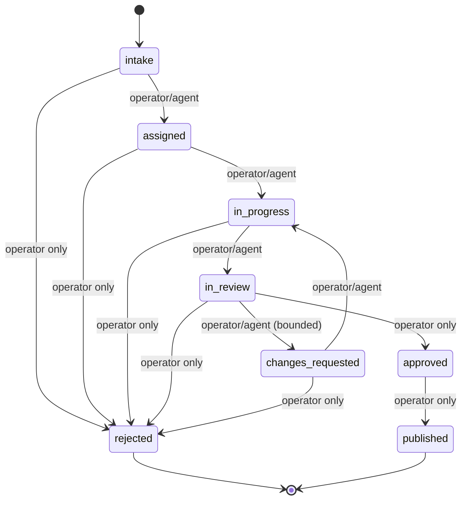

# Editorial domain model

The domain lives in `src/domain/editorial` and is the pure, I/O-free core of StoryRail. Everything else is an adapter or workflow around it. It defines branded identifiers, value objects, validation functions, and result types following an `{ ok: true } | { ok: false, error }` convention.

## Branded identifiers

`src/domain/editorial/types.ts` declares a branded `Identifier<Name>` type and constructors. All entity and run identifiers are opaque string brands, not raw strings:

- `SourceId`, `SourceExtractionId`, `SourceEvidencePreparationId`, `StoryId`, `ArticleId`, `AgentRunId`, `OperatorId`, `TransitionId`

Constructors (`sourceId(value)`, `storyId(value)`, etc.) cast a `string` to the branded type at the system boundary.

## Actor model

An `EditorialActor` is a discriminated union identifying who performed an attributable editorial act:

```ts
type EditorialActor = OperatorActor | AgentActor;

interface OperatorActor {
  type: "operator";
  operatorId: OperatorId;
}
interface AgentActor {
  type: "agent";
  role: AgentRole;
  runId: AgentRunId;
}
```

Agent roles are bounded: `assignment_editor`, `writer`, `fact_checker`, `editor_in_chief` (`AGENT_ROLES` in `types.ts`). Durable facts identify a specific operator or tie an agent actor to a specific agent run.

## Story and the state machine

A `Story` is the central editorial object:

```ts
interface Story {
  readonly id: StoryId;
  readonly title: string;
  readonly state: StoryState;
  readonly revisionCycle: number;
  readonly createdAt: string;
  readonly updatedAt: string;
}
```

`STORY_STATES` defines eight states: `intake`, `assigned`, `in_progress`, `in_review`, `changes_requested`, `approved`, `rejected`, `published`.

### Permitted transitions

`src/domain/editorial/state-machine.ts` encodes the permitted transitions (`PERMITTED_STORY_TRANSITIONS`) and the `transitionStory` function:



Transition rules enforced by `transitionStory`:

1. **Reason required** — a non-empty editorial `reason` is required for every transition (`REASON_REQUIRED`).
2. **Permitted transition** — the previous→next pair must be in `PERMITTED_STORY_TRANSITIONS` (`INVALID_TRANSITION`).
3. **Operator-only states** — only an `operator` actor can transition to `approved`, `rejected`, or `published` (`OPERATOR_REQUIRED`).
4. **Revision limit** — at most `MAX_REVISION_CYCLES = 2` returns from `in_review` to `changes_requested` (`REVISION_LIMIT_REACHED`). Each such transition increments `revisionCycle`; all other transitions preserve it.

A successful transition returns the updated `Story` and a `StoryTransitionReceipt` recording the transition id, story id, previous/next states, actor, reason, occurredAt, and resulting revision cycle. Receipts are the durable audit record of state changes.

## Source intake and canonical URLs

`source-url.ts` provides `canonicalizeSourceUrl`, which conservatively normalizes a submitted URL for exact duplicate comparison:

- Rejects empty/too-long URLs (`SOURCE_URL_REQUIRED`, `SOURCE_URL_TOO_LONG` with `MAX_SUBMITTED_SOURCE_URL_LENGTH = 2048`).
- Requires a valid absolute URL (`INVALID_SOURCE_URL`).
- Requires `http:`/`https:` protocol (`UNSUPPORTED_SOURCE_PROTOCOL`).
- Rejects embedded credentials (`SOURCE_URL_CREDENTIALS_NOT_ALLOWED`).
- Strips tracking parameters (`utm_*` plus `fbclid`, `gclid`, `dclid`, `msclkid`, `mc_cid`, `mc_eid`) and the hash fragment.

The canonical URL is a branded `CanonicalSourceUrl`, distinct from the submitted URL. `source-intake.ts` (`intakeUrlSource`) canonicalizes, then checks existing Sources for an exact canonical-URL match to produce a `DUPLICATE_SOURCE` error. A successful intake returns a `UrlSource` carrying the exact submitted URL, the canonical URL, the submitter, and the receipt time.

Invariants (see `docs/product/terminology.md`): a Source is not a Story; a Source extraction does not create, replace, or recanonicalize Source identity; exact Source duplication is not semantic Story duplication.

## Source extraction

`source-extraction-types.ts` and `source-extraction.ts` model one immutable, attributable extraction attempt on an already-preserved URL Source:

- `SOURCE_EXTRACTION_FAILURE_CODES`: `RETRIEVAL_FAILED`, `RETRIEVAL_TIMED_OUT`, `RESPONSE_REJECTED`, `UNSUPPORTED_CONTENT_TYPE`, `CONTENT_TOO_LARGE`, `EXTRACTION_FAILED`. Each failure carries a `retryable` flag.
- A successful `ExtractedSourceDocument` has `format: "markdown"`, required non-empty `content`, and nullable `title`, `byline`, `publishedAt`, `language`.
- `recordSourceExtraction` validates the extractor descriptor (`SOURCE_EXTRACTOR_KEY_REQUIRED`, `SOURCE_EXTRACTOR_VERSION_REQUIRED`) and requires non-empty Markdown content for success (`EXTRACTED_SOURCE_CONTENT_REQUIRED`). Both succeeded and failed outcomes are retained; each retry is a distinct attempt and does not replace earlier extractions or Source identity.

## Prepared Evidence

`source-evidence-preparation-types.ts` and `source-evidence-preparation.ts` model an optional, model-derived preparation of one successful raw extraction. Each successful or failed attempt records its preparer/model metadata and timing and remains immutable. A successful prepared document never replaces the raw extraction.

## Source triage

`source-triage-types.ts` and `source-triage.ts` model a manual triage decision on a pending Source. `SOURCE_TRIAGE_DECISION_KINDS` are `new_story`, `existing_story`, `skip`.

`decideSourceTriage` enforces:

- A non-empty `reason` (`SOURCE_TRIAGE_REASON_REQUIRED`).
- `skip` must not reference a Story (`SOURCE_TRIAGE_STORY_FORBIDDEN`).
- `new_story` and `existing_story` must reference a Story (`SOURCE_TRIAGE_STORY_REQUIRED`).

A `SourceTriageDecision` records the sourceId, decision, optional storyId, trimmed reason, the `decidedBy` actor, and `decidedAt`.

## Story creation and Source attachment

- `story-creation.ts` (`createStory`): trims the title; rejects empty titles (`STORY_TITLE_REQUIRED`); otherwise returns a new `Story` in state `intake` with `revisionCycle: 0`.
- `story-source-attachment.ts` (`attachSourceToStory`): requires non-empty `relevance` (`STORY_SOURCE_RELEVANCE_REQUIRED`); otherwise returns an immutable `StorySourceAttachment` (storyId, sourceId, relevance, attachedBy, attachedAt).

Both functions copy the actor defensively (`copyActor`) so returned objects do not share actor references with the caller's input.

## Re-export barrel

`src/domain/editorial/index.ts` re-exports every module in the domain, and `src/application/index.ts` re-exports the application layer's domain-facing types so callers import from a single barrel.
