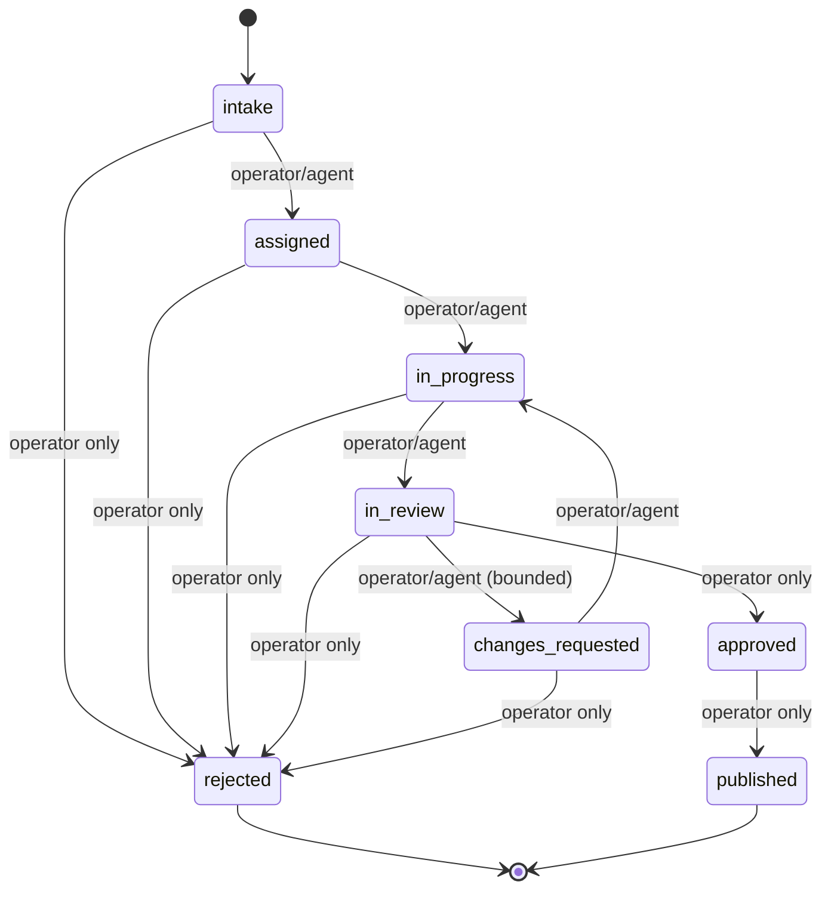

# Editorial domain model

The domain lives in `src/domain/editorial` and is the pure, I/O-free core of StoryRail. Everything else is an adapter or workflow around it. It defines branded identifiers, value objects, validation functions, and result types following an `{ ok: true } | { ok: false, error }` convention.

## Branded identifiers

`src/domain/editorial/types.ts` declares a branded `Identifier<Name>` type and constructors. All entity and run identifiers are opaque string brands, not raw strings:

- `SourceId`, `SourceExtractionId`, `SourceEvidencePreparationId`, `StoryId`, `ArticleId`, `ArticleRevisionId`, `AgentRunId`, `AgentProfileId`, `AssignmentId`, `OperatorId`, `TransitionId`, `ReviewDecisionId`

Constructors (`sourceId(value)`, `storyId(value)`, etc.) cast a `string` to the branded type at the system boundary.

## Actor model

An `EditorialActor` is a discriminated union identifying who performed an attributable editorial act:

```ts
type EditorialActor = OperatorActor | AgentActor;

interface OperatorActor {
  type: "operator";
  operatorId: OperatorId;
}
interface AgentActor {
  type: "agent";
  role: AgentRole;
  runId: AgentRunId;
}
```

Agent roles are bounded: `assignment_editor`, `writer`, `fact_checker`, `editor_in_chief` (`AGENT_ROLES` in `types.ts`). Durable facts identify a specific operator or tie an agent actor to a specific agent run.

## Story and the state machine

A `Story` is the central editorial object:

```ts
interface Story {
  readonly id: StoryId;
  readonly title: string;
  readonly state: StoryState;
  readonly revisionCycle: number;
  readonly createdAt: string;
  readonly updatedAt: string;
}
```

`STORY_STATES` defines eight states: `intake`, `assigned`, `in_progress`, `in_review`, `changes_requested`, `approved`, `rejected`, `published`.

### Permitted transitions

`src/domain/editorial/state-machine.ts` encodes the permitted transitions (`PERMITTED_STORY_TRANSITIONS`) and the `transitionStory` function:



Transition rules enforced by `transitionStory`:

1. **Reason required** — a non-empty editorial `reason` is required for every transition (`REASON_REQUIRED`).
2. **Permitted transition** — the previous→next pair must be in `PERMITTED_STORY_TRANSITIONS` (`INVALID_TRANSITION`).
3. **Operator-only states** — only an `operator` actor can transition to `approved`, `rejected`, or `published` (`OPERATOR_REQUIRED`).
4. **Revision limit** — at most `MAX_REVISION_CYCLES = 2` returns from `in_review` to `changes_requested` (`REVISION_LIMIT_REACHED`). Each such transition increments `revisionCycle`; all other transitions preserve it.

A successful transition returns the updated `Story` and a `StoryTransitionReceipt` recording the transition id, story id, previous/next states, actor, reason, occurredAt, and resulting revision cycle. Receipts are the durable audit record of state changes and are persisted in `storyrail.story_transition_receipts` (see [database schema](database-schema.md)).

The first two transitions are exercised by the application layer: `assignStory` performs `intake` → `assigned` atomically with the durable Assignment and its receipt, and `createWriterDraft` performs `assigned` → `in_progress` atomically with the first Article, Revision 1, the Writer `AgentRun`, and its receipt. The review workflow adds three more: `submitStoryReview` performs `in_progress` → `in_review`, `recordStoryReviewDecision` performs `in_review` → `approved` (incrementing nothing) or `in_review` → `changes_requested` (incrementing `revisionCycle`, bounded by `MAX_REVISION_CYCLES`), and `createWriterRevision` performs `changes_requested` → `in_progress` atomically with the next immutable Article Revision and a Writer revision `AgentRun` (preserving `revisionCycle`). The rejection workflow adds one more: `rejectStory` performs any of `intake`, `assigned`, `in_progress`, `in_review`, or `changes_requested` → `rejected` (operator-only, preserving `revisionCycle`) atomically with the transition receipt; rejection is terminal and preserves all prior work without a separate domain entity. All transitions and their receipts are committed in a single database transaction by the corresponding persistence adapter.

## Source intake and canonical URLs

`source-url.ts` provides `canonicalizeSourceUrl`, which conservatively normalizes a submitted URL for exact duplicate comparison:

- Rejects empty/too-long URLs (`SOURCE_URL_REQUIRED`, `SOURCE_URL_TOO_LONG` with `MAX_SUBMITTED_SOURCE_URL_LENGTH = 2048`).
- Requires a valid absolute URL (`INVALID_SOURCE_URL`).
- Requires `http:`/`https:` protocol (`UNSUPPORTED_SOURCE_PROTOCOL`).
- Rejects embedded credentials (`SOURCE_URL_CREDENTIALS_NOT_ALLOWED`).
- Strips tracking parameters (`utm_*` plus `fbclid`, `gclid`, `dclid`, `msclkid`, `mc_cid`, `mc_eid`) and the hash fragment.

The canonical URL is a branded `CanonicalSourceUrl`, distinct from the submitted URL. `source-intake.ts` (`intakeUrlSource`) canonicalizes, then checks existing Sources for an exact canonical-URL match to produce a `DUPLICATE_SOURCE` error. A successful intake returns a `UrlSource` carrying the exact submitted URL, the canonical URL, the submitter, and the receipt time.

Invariants (see `docs/product/terminology.md`): a Source is not a Story; a Source extraction does not create, replace, or recanonicalize Source identity; exact Source duplication is not semantic Story duplication.

## Source extraction

`source-extraction-types.ts` and `source-extraction.ts` model one immutable, attributable extraction attempt on an already-preserved URL Source:

- `SOURCE_EXTRACTION_FAILURE_CODES`: `RETRIEVAL_FAILED`, `RETRIEVAL_TIMED_OUT`, `RESPONSE_REJECTED`, `UNSUPPORTED_CONTENT_TYPE`, `CONTENT_TOO_LARGE`, `EXTRACTION_FAILED`. Each failure carries a `retryable` flag.
- A successful `ExtractedSourceDocument` has `format: "markdown"`, required non-empty `content`, and nullable `title`, `byline`, `publishedAt`, `language`.
- `recordSourceExtraction` validates the extractor descriptor (`SOURCE_EXTRACTOR_KEY_REQUIRED`, `SOURCE_EXTRACTOR_VERSION_REQUIRED`) and requires non-empty Markdown content for success (`EXTRACTED_SOURCE_CONTENT_REQUIRED`). Both succeeded and failed outcomes are retained; each retry is a distinct attempt and does not replace earlier extractions or Source identity.

## Prepared Evidence

`source-evidence-preparation-types.ts` and `source-evidence-preparation.ts` model an optional, model-derived preparation of one successful raw extraction. Each successful or failed attempt records its preparer/model metadata and timing and remains immutable. A successful prepared document never replaces the raw extraction.

## Source triage

`source-triage-types.ts` and `source-triage.ts` model a manual triage decision on a pending Source. `SOURCE_TRIAGE_DECISION_KINDS` are `new_story`, `existing_story`, `skip`.

`decideSourceTriage` enforces:

- A non-empty `reason` (`SOURCE_TRIAGE_REASON_REQUIRED`).
- `skip` must not reference a Story (`SOURCE_TRIAGE_STORY_FORBIDDEN`).
- `new_story` and `existing_story` must reference a Story (`SOURCE_TRIAGE_STORY_REQUIRED`).

A `SourceTriageDecision` records the sourceId, decision, optional storyId, trimmed reason, the `decidedBy` actor, and `decidedAt`.

## Story creation and Source attachment

- `story-creation.ts` (`createStory`): trims the title; rejects empty titles (`STORY_TITLE_REQUIRED`); otherwise returns a new `Story` in state `intake` with `revisionCycle: 0`.
- `story-source-attachment.ts` (`attachSourceToStory`): requires non-empty `relevance` (`STORY_SOURCE_RELEVANCE_REQUIRED`); otherwise returns an immutable `StorySourceAttachment` (storyId, sourceId, relevance, attachedBy, attachedAt).

Both functions copy the actor defensively (`copyActor`) so returned objects do not share actor references with the caller's input.

## Agent Profiles

`agent-profile-types.ts` and `agent-profile.ts` model an immutable configuration snapshot for a bounded editorial persona. `AGENT_PROFILE_ROLES` are `assignment_editor`, `writer`, `editor_in_chief` — a strict subset of `AGENT_ROLES` (profiles do not configure `fact_checker`). An `AgentProfile` carries `id`, `role`, trimmed `name` and `instructions`, an optional `ModelDescriptor | null`, and a `builtIn` flag.

`createAgentProfile` validates:

- A supported role (`AGENT_PROFILE_ROLE_UNSUPPORTED`).
- Non-empty trimmed `name` and `instructions` (`AGENT_PROFILE_NAME_REQUIRED`, `AGENT_PROFILE_INSTRUCTIONS_REQUIRED`).
- A boolean `builtIn` (`AGENT_PROFILE_BUILT_IN_INVALID`).
- When `model` is non-null, exactly `{ provider, model }` with non-empty trimmed strings (`AGENT_PROFILE_MODEL_INVALID`, `..._PROVIDER_REQUIRED`, `..._IDENTIFIER_REQUIRED`).

Profiles are configuration, not execution: they do not invoke models or carry credentials. Migration `0027` seeds three built-in profiles (`storyrail-assignment-editor-v1`, `storyrail-general-writer-v1`, `storyrail-director-v1`) and enforces that a non-built-in profile must be a `writer` (custom profiles can only be Writers).

## Newsroom standards

`newsroom-standards-types.ts` and `newsroom-standards.ts` model the editorial standards that govern how work reads in a newsroom (voice, usage, publication practices). A `NewsroomStandards` record carries `id`, `revisionNumber`, `text`, `updatedBy` (must be an `OperatorActor`), and `updatedAt`.

`recordNewsroomStandards` validates:
- Identity fields: non-empty `id` and `updatedAt`, and `updatedBy` must be an operator with non-empty `operatorId` (`NEWSROOM_STANDARDS_IDENTITY_INVALID`).
- `revisionNumber` must be an integer ≥ 1 (`NEWSROOM_STANDARDS_REVISION_INVALID`).
- `text` must be non-empty and ≤ `MAXIMUM_STANDARDS_CHARACTERS` (8,000) (`NEWSROOM_STANDARDS_TEXT_INVALID`).

Standards are append-only and timestamped: editing creates a new revision rather than replacing the existing text. The standards a run worked under are derived from when the run started rather than being copied onto every run, because both records already fix themselves in time. Standards govern how work reads, never what may be claimed; they are placed after each role's own rules in system prompts and labelled as what they are.

Migration `0063` creates the `storyrail.newsroom_standards` table and seeds an initial empty standards document.

## Assignments

`assignment-types.ts` and `assignment.ts` model an immutable, operator-created brief that selects one Writer Profile and snapshots every attached Source identity. An `Assignment` carries `id`, `storyId`, `writerProfileId`, a readonly `sourceIds` snapshot, trimmed `angle`, `brief`, optional `constraints: string | null`, `assignedBy`, and `assignedAt`.

`createAssignment` validates:

- Non-empty trimmed `angle` and `brief` (`ASSIGNMENT_ANGLE_REQUIRED`, `ASSIGNMENT_BRIEF_REQUIRED`).
- `constraints` is `null` or a non-empty trimmed string (`ASSIGNMENT_CONSTRAINTS_INVALID`).
- Non-empty `writerProfileId` (`ASSIGNMENT_WRITER_PROFILE_REQUIRED`).
- The `assignedBy` actor is an `operator` or an `assignment_editor` agent (`ASSIGNMENT_ACTOR_NOT_ALLOWED`) — Writers, fact-checkers, and the Director may not create Assignments.
- No duplicate `sourceIds` (`ASSIGNMENT_SOURCE_DUPLICATE`).

The `sourceIds` snapshot is taken server-side by `assignStory` from the authoritative Story inspection, not submitted by the client. One Story has at most one Assignment (enforced by a unique `story_id` in `storyrail.story_assignments`).

## Assignment Proposals

`assignment-proposal-types.ts` and `assignment-proposal.ts` model a supervised Assignment Editor suggestion that prefills the manual Assignment form. An `AssignmentProposal` carries `writerProfileId`, trimmed `angle`, `brief`, optional `constraints`, and a trimmed `reason`. `createAssignmentProposal` validates the same non-empty/trim rules as `createAssignment` (minus the actor and source snapshot) plus a non-empty `reason` (`ASSIGNMENT_PROPOSAL_REASON_REQUIRED`). A proposal never creates an Assignment or transitions a Story; the operator reviews or edits it before the manual `assignStory` call.

## AgentRuns

`agent-run-types.ts` and `agent-run.ts` model one immutable, attributable execution record. An `AgentRun` is a discriminated union over four supported role/operation pairs:

- `assignment_editor` + `assignment_proposal` — succeeds with an `AssignmentProposal` or fails with a `ModelFailureCode`/`retryable` pair.
- `writer` + `article_draft` — succeeds with `articleId`/`revisionId` references or fails with the same failure shape.
- `writer` + `article_revision` — succeeds with `articleId`/`revisionId` references (the next revision) or fails with the same failure shape. The input extends the draft input with an `article` snapshot, the current `revision` snapshot (revision number 1–3), the durable `directorReview` recommendation, and the operator `reviewDecision` that requested changes. `input.story.state` must be `changes_requested` and `input.story.revisionCycle` must be between 1 and 2.
- `editor_in_chief` + `article_review` — succeeds with a `DirectorReviewRecommendation` (see [Director review](#director-review)) or fails with the same failure shape.

All four carry a frozen `input` snapshot of the Story metadata, an `EvidenceReference[]` (each `{ sourceId, relevance, evidenceKind: "prepared" | "raw", evidenceId }`), `unavailableSourceIds`, and role-specific fields (Writer candidates for the editor; the full Assignment for the writer and Director). `recordAgentRun` validates identities, the role/operation pairing, model and prompt descriptors, the input snapshot, evidence uniqueness and disjointness (selected evidence and unavailable Sources must not overlap), timestamps, and the outcome shape. For successful editor runs it re-validates the embedded proposal through `createAssignmentProposal` and requires the chosen Writer to be in `input.writerProfileIds`; for successful writer draft runs it requires `input.story.state === "assigned"` and the Assignment's Source snapshot to exactly partition into selected evidence plus unavailable Sources; for successful writer revision runs it additionally validates that the article and revision snapshots cross-reference the assignment, that the revision number matches `story.revisionCycle`, that the embedded Director review is valid, and that the embedded `reviewDecision` is an operator `request_changes` decision matching the current article/revision; for successful Director runs it re-validates the embedded review through `createDirectorReview` and requires `input.story.state === "in_review"` plus a full Assignment, Article, and Revision snapshot (revision number 1–3). The DB schema (migration `0030`, extended by `0031`, `0038`, and `0041`) mirrors these invariants in SQL.

## Director review

`director-review-types.ts` and `director-review.ts` model the advisory evaluation the Director produces against one exact Article revision. A `DirectorReviewRecommendation` carries a `recommendation` (`"approve"` or `"request_changes"`), a non-empty `summary`, a `checks` record over five fixed check names (`assignment`, `accuracy`, `headline`, `structure`, `style` — each `{ status: "pass" | "needs_changes", note }`), and optional `revisionInstructions: string | null`.

`createDirectorReview` validates:

- A non-empty `summary` and a non-empty `note` on every check (`DIRECTOR_REVIEW_INVALID`).
- **Consistency** — an `approve` recommendation requires all checks to pass and `revisionInstructions` to be `null`; a `request_changes` recommendation requires at least one `needs_changes` check and non-empty actionable `revisionInstructions`.

The review is advisory: it is recorded as the `review` field of a succeeded Director `AgentRun` but never mutates the Article or Story. The operator may override the recommendation when recording a [ReviewDecision](#reviewdecision).

## ReviewDecision

`review-decision-types.ts` and `review-decision.ts` model one durable operator-owned approval or request-changes decision for an Article revision. A `ReviewDecision` carries `id` (`ReviewDecisionId`), `storyId`, `articleId`, `revisionId`, `directorRunId` (the exact succeeded Director `AgentRunId`), `decision` (`"approve"` or `"request_changes"`), a non-empty `reason`, `decidedBy` (must be an `OperatorActor`), and `decidedAt`.

`createReviewDecision` validates:

- Non-empty identities and `decidedAt` (`REVIEW_DECISION_IDENTITY_INVALID`).
- A supported `decision` value (`REVIEW_DECISION_VALUE_INVALID`).
- A non-empty `reason` (`REVIEW_DECISION_REASON_REQUIRED`).
- That `decidedBy` is an operator with a non-empty `operatorId` (`REVIEW_DECISION_OPERATOR_REQUIRED`) — an agent cannot record a review decision.

The decision is persisted atomically with the Story transition and receipt: `approve` moves the Story to `approved`; `request_changes` moves it to `changes_requested` (incrementing `revisionCycle`, bounded by `MAX_REVISION_CYCLES`). See [application workflows](application-workflows.md) for the `recordStoryReviewDecision` orchestration.

## Articles and Revisions

`article-types.ts` and `article.ts` model the durable editorial work product. An `Article` is a thin shell (`id`, `storyId`, `assignmentId`, `createdAt`); one Story has at most one Article. An `ArticleRevision` carries `id`, `articleId`, `revisionNumber` (typed as the literal union `1 | 2 | 3`), `writerProfileId`, `agentRunId`, trimmed `headline`, nullable trimmed `dek`, trimmed `bodyMarkdown`, `createdBy`, and `createdAt`.

- `createArticle` validates non-empty identities and `createdAt` (`ARTICLE_IDENTITY_INVALID`).
- `createFirstArticleRevision` requires `revisionNumber === 1` then delegates to `createArticleRevision`.
- `createArticleRevision` validates non-empty identities and `createdAt` (`ARTICLE_IDENTITY_INVALID`), that `revisionNumber` is an integer between 1 and 3 (`ARTICLE_REVISION_NUMBER_INVALID` — bounding Articles at Revision 3), non-empty `headline`/`bodyMarkdown` and a `null` or non-empty `dek` (`ARTICLE_REVISION_CONTENT_INVALID`), and that `createdBy` is the Writer agent of `agentRunId` (`ARTICLE_REVISION_AUTHOR_INVALID`).

Revision 1 is created by the [Writer draft workflow](application-workflows.md#writer-draft-workflow); Revisions 2 and 3 are appended by the [Writer revision workflow](application-workflows.md#writer-revision-workflow) after an operator requests changes.

## Re-export barrel

`src/domain/editorial/index.ts` re-exports every module in the domain — Source intake/extraction/triage/preparation, Story creation and attachment, the state machine, Agent Profiles, Assignments, Assignment Proposals, AgentRuns, Director review, ReviewDecisions, and Articles — and `src/application/index.ts` re-exports the application layer's domain-facing types so callers import from a single barrel, including the writer-revisions module.
