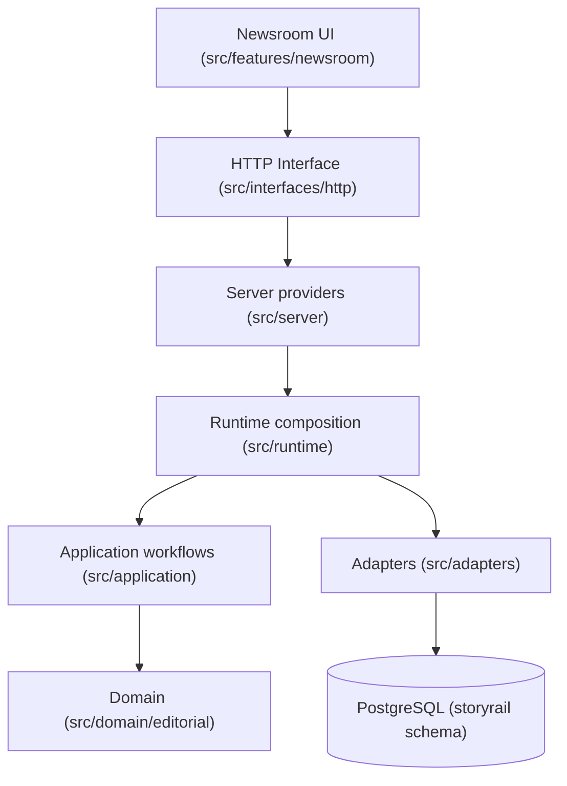

# StoryRail architecture overview

StoryRail is an open-source, agent-first editorial control plane. It is deliberately **not** a page-building CMS. It manages editorial state and is designed to publish through replaceable adapters in the future; Postgres is intended to be authoritative for editorial state, and agent memory must never become the database.

## Core editorial model

Three terms are kept strictly distinct (see `docs/product/terminology.md` and `AGENTS.md`):

- **Source** — preserved evidence or input, such as a URL and its extracted contents.
- **Story** — the central editorial object used to assess, organize, assign, and track coverage.
- **Article** — a versioned editorial work product that may be reviewed and eventually published.

Multiple Sources can inform one Story, and a Story can be rejected or merged without ever becoming an Article.

## Layered (hexagonal) structure

The codebase under `src/` is organized as a hexagonal architecture with the domain at the center and replaceable adapters on the outside:

| Layer            | Path                    | Responsibility                                                                                                                                                              |
| ---------------- | ----------------------- | --------------------------------------------------------------------------------------------------------------------------------------------------------------------------- |
| Domain           | `src/domain/editorial`  | Pure editorial types, validation, and the Story state machine. No I/O.                                                                                                      |
| Application      | `src/application`       | Use-case workflows that orchestrate domain rules with repository ports.                                                                                                     |
| Adapters         | `src/adapters`          | PostgreSQL persistence, Firecrawl extraction, and LangChain/OpenRouter structured-model implementations of the ports.                                                       |
| Runtime          | `src/runtime`           | Composes adapters and application services into focused frozen runtimes with injectable external seams.                                                                     |
| Server providers | `src/server`            | Lazy singletons that build runtimes from environment on first use.                                                                                                          |
| HTTP interface   | `src/interfaces/http`   | Hand-rolled request/response handlers that validate JSON and map workflow results to status codes.                                                                          |
| Next.js routes   | `src/app/api`           | Thin Next.js route handlers binding HTTP handlers to providers.                                                                                                             |
| Newsroom UI      | `src/features/newsroom` | React client shell with Story desk, Source-evidence intake, Source inbox, Agent Profiles, and a Story workspace covering assignment, Writer execution, and Article reading. |

## Six composed runtimes

StoryRail composes six independent runtimes rather than one global container:

1. **Source-evidence runtime** (`src/runtime/source-evidence-runtime.ts`) — requires `STORYRAIL_DATABASE_URL` and `FIRECRAWL_API_KEY`. Owns one `pg.Pool`. Exposes `preserveUrlSource`, `extractPersistedSource`, and the combined `preserveAndExtractUrlSource`.
2. **Evidence-preparation runtime** (`src/runtime/evidence-preparation-runtime.ts`) — requires `STORYRAIL_DATABASE_URL`, `OPENROUTER_API_KEY`, and `STORYRAIL_EVIDENCE_PREPARATION_MODEL`. Uses LangChain's OpenRouter adapter to create one immutable Prepared Evidence attempt from a successful raw extraction.
3. **Story runtime** (`src/runtime/story-runtime.ts`) — requires only `STORYRAIL_DATABASE_URL`. Owns a separate `pg.Pool`. Exposes Story creation, Source attachment, Story inspection, Story listing, pending Source inbox listing, Source triage decision recording, Agent Profile listing and custom Writer creation, manual `assignStory`, `submitStoryReview` (`in_progress` → `in_review`), and `recordStoryReviewDecision` (`in_review` → `approved`/`changes_requested`).
4. **Assignment-editor runtime** (`src/runtime/assignment-editor-runtime.ts`) — requires `STORYRAIL_DATABASE_URL`, `OPENROUTER_API_KEY`, and `STORYRAIL_ASSIGNMENT_EDITOR_MODEL`. Generates one supervised Assignment Editor proposal `AgentRun` for an Intake Story; it records the run but cannot create an Assignment or transition Story state.
5. **Writer runtime** (`src/runtime/writer-runtime.ts`) — requires `STORYRAIL_DATABASE_URL` and `OPENROUTER_API_KEY`, plus either the assigned Writer Profile's OpenRouter model or `STORYRAIL_WRITER_MODEL` as a default. Runs the assigned Writer against an Assigned Story to create the first Article and immutable Revision 1 and atomically transition the Story to `in_progress`, and runs supervised Writer revisions after an operator requests changes to append immutable Revision 2 or 3 and return the Story to `in_progress`.
6. **Director runtime** (`src/runtime/director-runtime.ts`) — requires `STORYRAIL_DATABASE_URL` and `OPENROUTER_API_KEY`, plus either the built-in Director Profile's OpenRouter model or `STORYRAIL_DIRECTOR_MODEL` as a default. Runs the supervised advisory Director review against an In Review Story and records a Director `AgentRun` (succeeded recommendation or safe failure). The Director cannot mutate the Article or Story state; only the operator's [review decision](application-workflows.md) transitions the Story.

Each runtime owns and closes only the `Pool` it creates. The integration test suite and a composed server runtime each own their own pools independently.

## Editorial lifecycle

The intended lifecycle (see `docs/product/vision.md`): preserve sources, form a Story, create an assignment, research and draft, review claims and prose, request bounded revisions, approve or reject, then publish or export through an explicit action.

```mermaid
flowchart LR
    URL[Submitted URL] --> PRES[Preserve + extract Source]
    PRES --> PREP[Optional Prepared Evidence]
    PRES --> INBOX[Source Inbox]
    PREP --> INBOX
    INBOX --> DECIDE{Triage decision}
    DECIDE -->|new/existing Story| STORY[Story + Source attachment]
    DECIDE -->|skip| SKIP[Durable skip]
    STORY --> PROP[Optional Assignment Editor proposal]
    PROP --> ASSIGN[Manual Assignment]
    STORY --> ASSIGN
    ASSIGN -->|intake to assigned| WRITER[Supervised Writer execution]
    WRITER -->|assigned to in_progress| DRAFT[Article Revision 1]
    DRAFT -->|operator submits| SUBMIT[In Review]
    SUBMIT --> DIRECTOR[Advisory Director review]
    DIRECTOR --> OPERATOR{Operator decision}
    OPERATOR -->|Approve| APPROVED[Approved]
    OPERATOR -->|Request changes, cycle 1 or 2| CHANGES[Changes requested]
    CHANGES -->|Writer revision, exact evidence reuse| REVISE[Article Revision 2 or 3]
    REVISE -->|changes_requested to in_progress| SUBMIT
    STORY -->|operator reject| REJECTED[Rejected, terminal]
    ASSIGN -->|operator reject| REJECTED
    DRAFT -->|operator reject| REJECTED
    SUBMIT -->|operator reject| REJECTED
    CHANGES -->|operator reject| REJECTED
    APPROVED --> PUBLISH[Publish or export]
```

The implemented vertical slice currently covers URL Source preservation and Firecrawl extraction, optional model-backed Prepared Evidence, durable Story creation, Story-Source attachment, Story inspection/listing read models, a pending Source inbox, manual Source triage decisions, durable Agent Profiles (built-in Assignment Editor, General Writer, and Director plus custom Writer creation), durable manual Assignments with the first `intake` → `assigned` Story transition and durable transition receipts, supervised Assignment Editor proposals recorded as `AgentRun`s, supervised Writer execution that creates the first Article and immutable Revision 1 with the `assigned` → `in_progress` transition, operator review submission (`in_progress` → `in_review`), supervised advisory Director review recorded as a Director `AgentRun`, operator-owned [review decisions](application-workflows.md) that atomically transition the Story to `approved` or `changes_requested`, supervised Writer revisions that append immutable Revision 2 or 3 from the exact historical evidence, Director review, and operator request-changes reason and atomically return the Story to `in_progress` (bounded at Revision 3), explicit operator [Story rejection](application-workflows.md) that terminally transitions `intake`, `assigned`, `in_progress`, `in_review`, or `changes_requested` to `rejected` with a required reason and an atomic transition receipt, and the newsroom workbench that ties intake, inbox, staff, assignment, writing, revision, review, decisions, and rejection together. Publishing workflows remain planned. See the [domain model](domain-model.md) and [HTTP API](http-api.md) for what is actually implemented.

## Core principles

- Human operators supervise exceptions and exercise editorial judgment.
- Originality, evidence, and provenance matter throughout the workflow.
- Automation is bounded, observable, and auditable.
- Editorial state is explicit and durable.
- Models, source extractors, and publication targets remain replaceable.
- Publishing is headless and API-oriented rather than tied to page building.

See the [source map](source-map.md) for exact file locations and [engineering workflow](../engineering-workflow.md) for contribution discipline.
